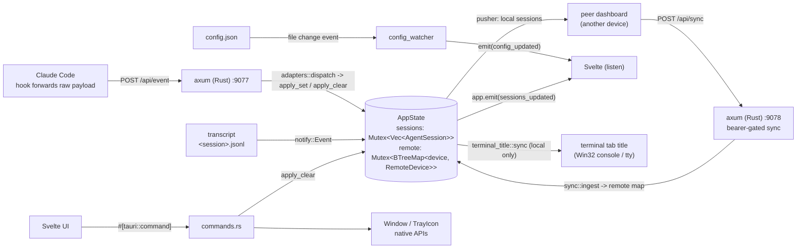

End-to-end: what happens when a Claude Code hook fires, when a transcript file gets a new line, or when you toggle a tray menu item.

## Input sources and data flow

Every mutation to **local** session state funnels through `state::apply_set` or `state::apply_clear` so the sticky-label rules, working-time accumulator, and upgrade-only merge policy are enforced in one place regardless of origin. Remote sessions arrive pre-enriched from the device that ran them (its own `apply_set` already applied those rules) and live in the separate `remote` map — `commands::resolved_snapshot` is the single point where the two sets combine on the way to the frontend.

## Path 1 — Hook POSTs event

1. Claude Code fires a lifecycle event (`UserPromptSubmit`, `Stop`, etc.). The hook command spawns `python claude_hook.py` and pipes the event payload to stdin.
2. `claude_hook.py` reads the payload, extracts `hook_event_name`, and POSTs `{client: "claude", event: <name>, payload: <verbatim>, console_pids: [...]}` to `$TAURI_DASHBOARD_URL/api/event` (default `http://127.0.0.1:9077/api/event`). The hook does no classification or config reading — `console_pids` is pure environment gathering: the processes attached to its console plus its ancestor pid chain (Windows) or the ancestor chain alone (macOS), used later for terminal tab titles.
3. `POST /api/event` hits the axum handler. Origin guard rejects non-null cross-origin requests.
4. `adapters::dispatch` routes by `client`; `adapters::claude::dispatch` matches on `event` and produces an `AdapterOutput::Set { input, transcript_path } | Clear { id } | Ignore`. All chat-id derivation, prompt cleaning, and transcript question-detection happen here.
5. For `Set`, `label_policy::select` decides the `(label, original_prompt)` pair.
6. Session-boundary marking. Claude `/clear` fires `SessionEnd` → `SessionStart`; the chat_id (derived from cwd) is unchanged but the JSONL is a new file. The handler covers this in two places: (a) on `Clear`, `AppState::mark_session_boundary` appends a `Separator` to the in-memory dialog and `PromptHistoryStore` persists it before `apply_clear` destroys the session — the following `SessionStart` then takes the "new" branch in `apply_set` and restores a dialog that already ends with the separator, so the upcoming user entry lands after it. (b) On `Set`, a defensive `transcript_path`-rotation check still calls `mark_session_boundary` if the new path differs from what `WatcherRegistry` is already watching — covers any rotation that happens without a preceding `SessionEnd`.
7. `AppState::apply_set` runs: if status transitions out of `working`, it accumulates elapsed time into `working_accumulated_ms`; if the transition is a task boundary (`done` / `idle` → `working`), it zeroes the accumulator; otherwise existing timers are preserved.
8. If `transcript_path` is present, `WatcherRegistry::start` spawns a per-session tokio task with a `notify::RecommendedWatcher` on the transcript's parent directory.
9. `emit_sessions_updated` broadcasts the fresh snapshot on the `sessions_updated` event. The same emit reconciles terminal tab titles (`terminal_title::sync`): every session whose status or display name changed gets its circle re-pushed onto the console the hook's `console_pids` identified.
10. The Svelte frontend's `listen` callback replaces its `$state` sessions array, Svelte's reactivity re-renders the list, the row updates within a frame.

## Path 2 — Transcript-driven updates

1. The watcher task from Path 1 is listening to filesystem events on the transcript's parent directory.
2. Claude Code writes a new JSONL line to the transcript. `notify` fires a `Modify` event; the watcher filters to events matching the exact transcript path.
3. The task sends a drain signal over an mpsc channel to itself. A 150ms debouncer collapses bursts (editors / streaming writes often produce several events per logical change).
4. `drain` reads the new bytes from the tracked byte offset, joins with leftover content from the previous drain, and splits into complete JSONL lines + a new leftover for the next call.
5. `infer_state` walks the new lines newest-first, skipping non-conversational entries (metadata, sidechains, synthetic errors). Returns the current `state`, latest `model`, latest summed input-side token count, and the latest assistant text block.
6. `apply_watcher_update` merges the metric inference into the session: watcher can set status to `working`, update `model`, update `input_tokens`, but cannot roll a session back to `done`, `idle`, or `error` — hook events stay authoritative for terminal states. This avoids the race where the watcher reads a trailing assistant text as "done" while a fresh turn is already in flight. The single exception is a `done → awaiting` *correction*: because the `Stop` hook fires before the final assistant turn flushes to JSONL (below), it can't see a trailing question and defaults to `done`; once the watcher flushes that text and `flushed_turn_is_question` confirms it (reusing the adapter's `is_a_question`), `AppState::promote_done_to_awaiting` flips the settled `done` row to `awaiting`. It is restricted to the `done → awaiting` transition, so a transient mid-turn assistant text ending in `?` (row still `working`) can't false-promote, and a row that already moved on (e.g. the user sent the next prompt) is left alone. If the chunk produced a `latest_assistant_text`, `AppState::apply_text_entries` replaces the latest Assistant entry within the current turn (appends if none exists yet) and `PromptHistoryStore` persists the change. The watcher owns dialog text because Claude Code's `Stop` hook fires before the final assistant turn is flushed to JSONL — reading from the hook records the prior turn's text.
7. If anything changed, the session's `updated` timestamp refreshes and `emit_sessions_updated` fires exactly as in Path 1.

The initial drain on watcher startup suppresses the inferred **state** AND the **latest assistant text** — a resume would otherwise snap to a stale "done" from the prior turn and duplicate the last assistant entry already in the restored dialog. Model and token counts still surface.

Tauri commands target native window/tray APIs (`hide_window`, `show_window`, `toggle_window`, `quit_app`); session state is only read from the frontend (`get_sessions`) — every local-session mutation arrives through the HTTP event path above, and remote sessions only through the sync path below.

## Path 3 — Tray toggles

1. User clicks "Always on top" in the tray menu. `muda` fires a `MenuEvent` with the item's id.
2. The tray handler calls `window.set_always_on_top(new_state)` directly on the native window — no IPC round-trip.
3. `ConfigState::with_mut` flips `always_on_top` in the managed config. `ConfigState::save_to_disk` writes `config.json`.
4. The tray's `CheckMenuItem::set_checked` syncs the visual checkmark.
5. `emit_config_updated` broadcasts the new config. The frontend picks up the updated color thresholds, token-window lookup, and (future-proof) any UI-driving fields.

## Path 4 — External config edits

1. User edits `config.json` directly (via the "Open config/logs location" tray shortcut or any editor).
2. `config_watcher` — a `notify::RecommendedWatcher` on the config directory — receives a `Modify` event.
3. The 150ms debouncer waits for any rename-based atomic writes to settle.
4. `Config::load_or_default` re-reads the file. Serde serializes both the new and current in-memory configs to JSON strings; if they're byte-identical, the reload is skipped — this is how our own tray writes avoid re-triggering the reload path.
5. `apply_config_to_window` applies runtime-safe changes (always-on-top, saved window position). Port changes are intentionally ignored on hot-reload and require a restart.
6. `config_updated` is emitted and the tray check marks re-sync.

## Path 5 — Peer sync (multi-device)

Dashboards on other devices push their sessions here, and this dashboard pushes its own to them — see [Features → multi-device sync](../features#multi-device-sync) for the user-facing behavior and [HTTP API → sync API](http-api#sync-api) for the wire contract.

**Outbound:** every `emit_sessions_updated` pokes the `SyncDirty` notify; the pusher task debounces 300ms (a 30s heartbeat fires regardless) and POSTs to each `config.sync.peers` entry: a full metadata snapshot of the **local** sessions plus a bounded chunk of dialog backlog — the *oldest* ~256KB of entries above that peer's watermark, in timestamp order. Each acknowledged chunk advances the watermark and the next chunk follows immediately, so a peer that was offline drains the whole backlog within one cycle — but only after proving reachable, one bounded POST at a time; a *down* peer costs each failed cycle one bounded build + connect attempt instead of an ever-growing full-backlog serialization. The watermark advances only on a 2xx, so a failed push (peer offline) re-sends the missed entries next time. Received remote sessions are never re-broadcast — and remote-driven changes deliberately skip the poke (see inbound below): content can't echo, but the poke itself would, ping-ponging pushes between two devices at the debounce period.

**Inbound:** `POST /api/sync` (bearer-gated, port `sync.listen_port`) namespaces incoming ids to `{device}/{raw_id}`, stamps `origin`, wholesale-replaces that device's metadata (absence = removal), and merges dialog deltas via `state::merge_dialog_entries` — the same turn-aware, replay-safe merge the transcript watcher uses. Deltas are merged only when contiguous with what's held (the push's `delta_from` watermark overlaps the newest held entry, or is `0` = a complete dialog); a floating fragment — newer entries with a hole below them, e.g. a fresh install receiving deltas from a long-running origin — is discarded so held dialogs are gap-free by construction, and the on-open catch-up fills in the rest. Then `emit_sessions_updated_remote` re-emits the merged snapshot — UI-only, without the `SyncDirty` poke or the terminal-title pass of Path 1's emit, so a received push can never trigger a push back. A reaper drops devices silent for 90s (also emitting the remote variant).

Accumulated remote dialogs are persisted one file per device (`remote_history/<device>.json` in the app data dir, mirroring `prompt_history.json` for local sessions) and re-seeded at ingest, so a dashboard restart keeps them. When the history window opens a remote session, `open_history` additionally fires a catch-up `GET /api/sync/dialog?id=` against the origin device for its **full** dialog and merges the response — the completeness guarantee for whatever disk can't cover, e.g. a fresh install while the origin's pusher watermark is already advanced (the dedup merge makes the overlap free; no held timestamp can serve as a `since` watermark, because the missing entries sit *below* the newest held one). The fetch is bracketed in `history_loading` events, which the history window renders as a loading hint until the catch-up lands or fails. Notifications, persistence, terminal titles, and the watcher never see remote sessions — they read `AppState::sessions` directly, and remote rows live only in the `remote` map.

## Sticky-label state machine

The `(label, original_prompt)` decision rules and the UI display rule live in [Sticky labels](sticky-labels). Every `apply_set` call funnels through `src-tauri/src/label_policy.rs::select`, so the rules are enforced in one place regardless of which path fired the event.
