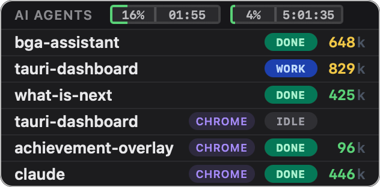
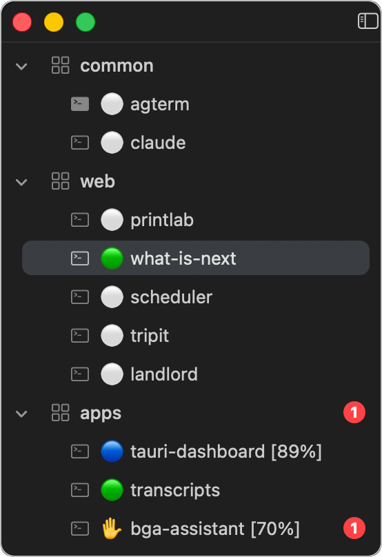
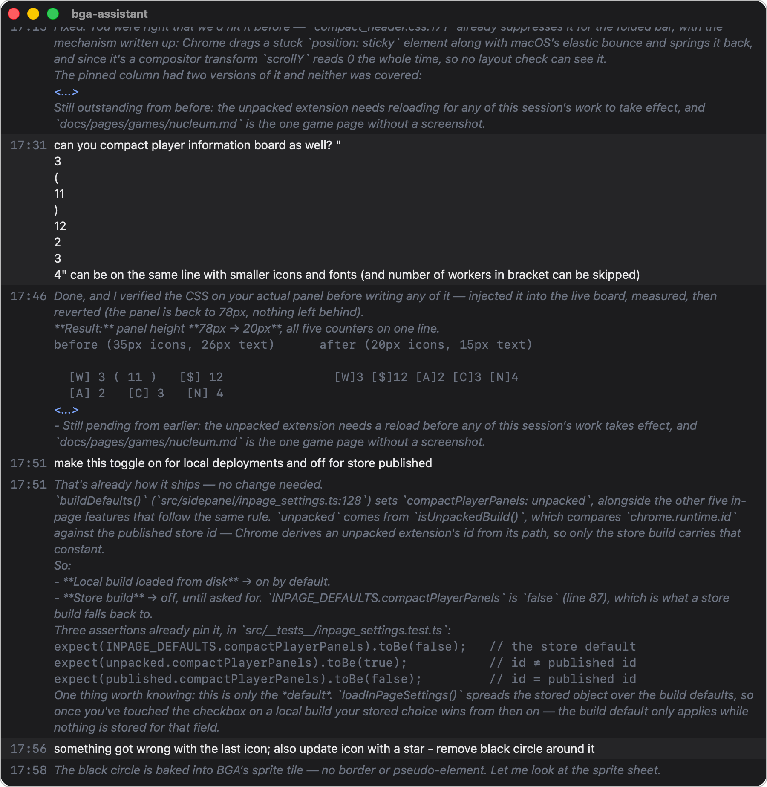
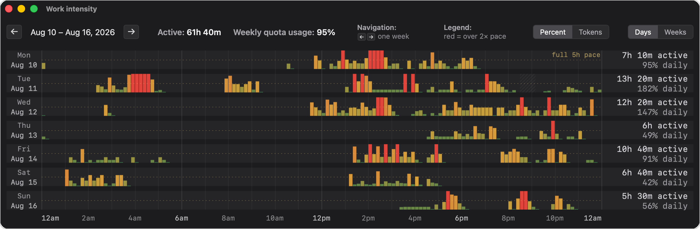

A compact desktop widget that helps you keep an eye on your Claude Code sessions.

## Session identity

Each Claude Code session becomes one row. The row's `id` is *initially* derived from the working directory of the session's **first** event — if `cwd` sits under the configured `projects_root`, the relative path becomes the id with slashes, dashes, and underscores replaced by spaces. The id is then locked to the session, even if the agent `cd`s into a different folder mid-conversation.

**Renaming a session.** Double-click a row's name to edit it — Enter saves, Esc cancels. The custom name is persisted, so a later Claude session in the same directory shows the same name.

## Live status

The row's status badge tracks the agent in real time:

- **WORK** — Claude is working on your task. Timer accumulates total time spent working on the same prompt across approval cycles.
- **WAIT** — the main turn finished but background work Claude started (a subagent, or a background command like a dev server) is still running, so the row stays active (light-blue) rather than dropping to DONE while work continues. If you stop that work yourself instead of letting it finish, the row settles to DONE on its own after a while rather than staying stuck.
- **BLOCK** — Claude is blocked on you. The row shows the agent's current question or permission request.
- **IDLE** — the session is alive but not actively working, and nothing on it is waiting for you: a session you've just opened, one you've cleared, or one whose result you've already read. A task you cancel with Esc usually settles here too: cancelling sends no event of its own, but the dashboard notices the turn ended and settles the row back on its own — to idle, or back to a question it was waiting on (on by default, see [Settings](settings#behavior)).
- **DONE** — Claude finished the task and you haven't read it yet. Timer shows time since it finished. Once you've looked, the row drops to IDLE — see [Finished, and not yet read](#finished-and-not-yet-read).
- **ERROR** — the hook reported an error; the row shows the error text.

Each badge is color-coded, and BLOCK and ERROR pulse to draw your eye when a session needs attention.

**Rows clear when a session ends.** Clearing a session (`/clear`) or quitting it — typing `exit`, pressing Ctrl-D, or closing the terminal — removes its row, so the dashboard only shows sessions that are still around. Quitting doesn't always announce itself, so such a row could otherwise linger (often stuck on WORK if you quit mid-turn); the dashboard drops it once it confirms the session is gone. Reopen the same project and the row returns with its history. On by default — see [Settings](settings#behavior).

## Compact view

Turn on the tray's **Compact view** toggle for a denser widget: each row drops its current prompt and time-in-state, and the 5-hour / 7-day usage bars shrink to just their percentage and reset time — the segmented track giving way to a slim border that fills left-to-right and shifts green → amber → red as each limit climbs. What's left is the state badge, token count, and usage figures — nothing that needs reading, just glanceable numbers. Off by default.

## Color terminal tabs

Each session's status is mirrored onto the terminal tab it runs in, next to the session name — 🔵 working, ⏳ background work still running, ✋ blocked on you, 🟢 done, 🔴 error, ⚪ idle. Because a finished session drops to idle once you've read it, 🟢 marks the ones still waiting on you and ⚪ the ones you've been through — see [Finished, and not yet read](#finished-and-not-yet-read). Two of them deliberately aren't circles: an orange and a red circle read too alike at tab size, and no light-blue circle exists to mirror the widget's WAIT pill. A glance at your terminal tabs shows which session needs attention, even without the widget on screen. The title updates the moment the status changes and clears when the session ends. On by default; the tray's **Color terminal tabs** toggle turns it off.

Once a session's context usage climbs past a threshold (50% by default), the tab title also shows it — `🔵 printlab [67%]` — so a tab that's filling toward a `/compact` stands out among the rest. The number falls off again when a new task or `/clear` frees the context. See [Settings](settings#color-terminal-tabs) to change the threshold or turn the number off.

## Your sessions come back after a restart

Close the widget, update it, or reboot, and the sessions you had running are still there when it comes back — with the status each one was on, how long it has been sitting there, and its conversation. Without this the widget starts empty and a session only reappears when it next does something, which the ones that most need you never will: an agent parked on a question is waiting for *you*, so it will sit unheard for as long as you leave it.

It runs once, at start-up — retrying for a minute in case your terminal is still coming up, then stopping for good. It works because the status was never only in the widget. Every session's tab is already labelled with its state, so on start-up the widget cross-checks what your terminal is showing against the sessions actually running on the machine, and brings back only the ones both agree on — a tab whose agent has since quit does not come back, and neither does one the widget was never labelling. The read/unread distinction survives too, so a result you had already been through returns as IDLE rather than asking for you a second time.

Two things stay quiet on purpose. A session that was mid-task when the widget went down only comes back as working if it really is still working — otherwise it comes back idle rather than claiming a task that may have finished while the widget was away. And nothing that comes back this way sends you a notification: it is a state from before, and you were already told about it at the time.

On macOS with agterm, and on Windows. On by default; see [Settings](settings#behavior).

## Focus on the task

While Claude is blocked on you (BLOCK), the row shows the question or approval request, so you know what it needs. Once you answer and Claude resumes (WORK), the row goes back to showing your **original request** rather than the *yes* you typed — so a quick approval or a *continue* never replaces your task on screen. The work timer pauses during BLOCK — replaced by a timer counting how long Claude has been blocked on you — and resumes once the agent continues working on the task. A new top-level prompt after DONE / IDLE starts a fresh task.

For the full state machine and the rules that pick between the current text and the original request, see [Sticky labels](development/sticky-labels) in the Development section.

## Tracking the conversation flow

The dashboard doesn't just relay raw events — it reads the conversation to keep each row's status and the text it shows accurate. It tells a genuine question apart from a rhetorical sign-off, so a closing *"What's next?"* doesn't flip a finished session into BLOCK. It recognizes permission and plan-approval prompts as blocked states. It treats short replies like *"continue"* as resuming the current task rather than starting a new one. And it cleans up Claude's formatting so the text reads cleanly.

Several of these rules are tunable — see [Settings](settings) — and the full ruleset is documented under [Classification](development/classification).

## Finished, and not yet read

DONE means more than "finished" — it means **finished, and you haven't looked yet**. Once you read a session's result, its row drops to IDLE, because there is nothing left there that wants you. So the rows still showing DONE are exactly the ones with something waiting, and a glance at the widget is a to-do list rather than a history.

Reading is all it takes, and you don't have to type anything: opening the row's history counts, and so does *leaving* that session's terminal tab — switching away is the moment you're done with what was on screen, so that's when it counts. That last part needs a terminal the widget can follow: agterm on macOS, Windows Terminal on Windows. Because the terminal tab already shows 🟢 for done and ⚪ for idle, the distinction shows up there too without any extra marker. Start the agent on something new and it goes back to DONE when it finishes, since there's a fresh answer waiting.

This is deliberately not the same question as "are you at your desk". You can be typing away all afternoon in one session while another has sat finished and unopened since lunch — that one still wants you, and only a per-session answer can say so. On by default; see [Settings](settings#behavior).

Occasionally two agents end up answering to the same name — two projects in folders named alike, or two sessions started in one folder. Their terminal tabs then read the same, so the widget marks the row with a small **×2** after the name. It is worth knowing about: a row in that state may be mixing two conversations, and the dashboard can no longer tell which of them you looked at. Giving one of them a different name, by double-clicking it, separates them again.

## Instruction adherence

Over a long conversation an agent can gradually stop honoring its standing instructions. As an early-warning tripwire, the dashboard can hand each session a private one-time token when it starts and ask the agent to end every reply with it. Each time the agent finishes, the dashboard checks that the token is there — if it stays missing, the row is flagged with a ⚠ (on the dashboard, on the terminal tab, and as a Telegram ping), a cue to look closely at that session's output before trusting it, and perhaps to compact or re-anchor the conversation. The flag clears itself as soon as the agent's next reply carries the token again. The agent's name is also tinted by its canary status — green once it's confirmed following, amber while still unconfirmed, red if it's drifted. The token appears as a small, unobtrusive tag at the end of each reply in the agent's terminal; the dashboard strips it from its own history and notifications, so it never clutters what you read there. Off by default; see [Settings](settings#instruction-adherence).

## Context usage

The row shows the session's live context usage, updated as Claude works. The count is colored green → amber → red as it climbs toward the model's context window, so you can tell at a glance whether `/compact` is due.

## History window

Hover a session row for a quick tooltip listing its task prompts so far — one per line, with the current task marked. For the whole story, click the text below a session's name to open a History window — a chronological recap of your prompts and Claude's reply to each, with a separator marking the start of a new session. Useful for scrolling back through a long-running conversation without leaving the dashboard. The window opens maximized on the dashboard's screen; with **Save window position** enabled it reopens where you last left it.

Ctrl+`+` and Ctrl+`-` cycle through five font sizes; Esc closes the window. The choice persists to `config.json`.

## Notifications

Get pinged when a session needs you — for example, when it finishes or sits waiting while you're away from your machine. The widget watches your keyboard and mouse, so a session that finishes while you're sitting right there stays quiet (you already saw it), and you only get a ping once you've stepped away. For things you need to act on, like a pending question, it also pings after a set time even if you're present, so nothing waits on you forever. The delay scales with how much there is to read: reacting to a one-line "push?" is quick, but a page-full answer takes a while to get through, and to your machine reading it looks the same as being away — you're not touching the keyboard either way. So the widget waits longer before pinging when the agent's last message is long, giving you time to finish reading before it decides you've missed it. Once the agent moves on — you answer the prompt and it resumes work — the message is deleted automatically, so your Telegram chat shows only the sessions still waiting on you. You can also get a heads-up when a session's context fills past a percentage you choose, so a long run doesn't quietly run out of room — and like the other alerts, that message clears itself once the context usage drops back down (a new task or `/clear`). And when you've burned through your 5-hour or 7-day usage limit, the widget can ping you the moment that window resets, so you know you're clear to pick back up without watching the bars — it only fires when you'd actually run the window most of the way down, not on every routine reset. Notifications are delivered via Telegram and stay off until you configure them. See [Settings](settings) for setup.

When you want nothing held back — you're watching for anything at all — the tray's **High alert** toggle sends every notification the moment it happens, skipping the away-detection and reading delays entirely. It applies to the session states (finished, blocked, error) and leaves the context-usage and usage-limit pings on their own schedule.

## Keeping the Mac awake with the lid closed

macOS only. Shut the lid on a working agent and the Mac sleeps, taking the agent's task with it — which is exactly what happens when you pick the laptop up and walk somewhere. The tray's **Keep awake with lid closed** submenu holds sleep off while an agent is still working, so a closed laptop keeps going on the way between desks.

Because it's a big lever — a Mac that can't sleep also can't fall asleep to cool down or to save a dying battery — every hold is bounded. The clock starts when you close the lid, not when the work started, so shutting the lid always buys you a full window, and opening it again resets the clock for the next leg. When the window runs out, or the agent finishes, or the battery falls too low, the Mac goes back to sleeping normally on its own.

**Start now** begins a hold immediately whatever else is set — the one to reach for when you're about to pick the laptop up and off is otherwise fine. While it runs it shows the time remaining, and the tick sits on it rather than on the setting underneath, so the menu always tells you whether the Mac is actually being held. Below it, three settings decide how eager it is on its own: **off**; **on battery only**, which skips it while you're plugged in at a desk; and **always**, whenever an agent is working. Picking one of those ends a hold you started by hand. The window is the same either way — the submenu title shows how long it is — and the setting decides *when* a hold starts, never how long it lasts. The window length and the battery cut-off are yours to set — see [Settings](settings#keeping-the-mac-awake-with-the-lid-closed).

macOS has no ordinary way to do this — the setting it needs is one only an administrator can change — so the first hold asks for your password once, and then never again. Turning the feature off doesn't require your password, and the widget puts the setting back the moment it stops needing it, including if it's force-quit or the Mac restarts. If you'd rather not leave that permission in place at all, [Settings](settings#undoing-the-one-time-setup) shows how to take it back out.

## Usage limits

The header shows two bars tracking your Anthropic usage against the rolling 5-hour and 7-day rate limits, so you can see how much headroom is left before you hit a cap.

You can also surface a limit right on the tray icon, via the tray's **Tray usage badge** submenu — for the 5-hour or 7-day bucket, in one of two styles: **lights** recolor the dashboard's traffic-light icon, its three lamps stepping from green through amber to red as the bucket fills; or **number** shows the percentage itself, switching to the all-red light at 100%. Either way the icon's hover tooltip shows both figures. Off by default.

When the badge is on, the tray icon also flags the moment any session's context usage crosses a threshold you set — an at-a-glance warning that an agent is filling its context, right in the tray. The light styles gain a red border; the number style draws the digits over a red background. It's on by default — the tray's **Show high context usage** checkbox turns it off. See [Settings](settings) for the threshold.

## Work intensity

A separate window — opened from the tray's **Work intensity** item — charts how hard your agents have been working over time. Each bar covers a short slice of time and grows taller and warmer the busier that slice was. A **Days** view lays out one week as seven rows, one per day; a **Weeks** view gives one row per week and scrolls back through your history. Each view also totals the active time. With [multi-device sync](#multi-device-sync) configured, the chart covers your other devices too, so it shows the work done on the account as a whole rather than just here.

A **Percent | Tokens** switch picks what the bars measure, and the two answer different questions:

- **Percent** — how much of your 5-hour limit each slice burned, with a reference line marking the pace that would use the whole limit in five hours straight; anything past twice that pace is flagged red. This is the view for "am I about to run out".
- **Tokens** — how much work actually happened, counted from Claude Code's own records. Because it doesn't measure a share of anything, it stays comparable when your quota changes: switching plans or a promotional bump moves the percentages but leaves this view alone. It reaches back only as far as Claude Code's stored history, and stretches with nothing recorded are marked as unknown rather than shown as idle.

## Multi-device sync

Run the dashboard on more than one computer and each one can show the sessions from all of them. Sessions from another device appear in the same list with a small badge carrying that device's name, with everything a local row has — live status, the task in view, the context usage, and the History window recap. Renaming a remote row changes the name on the device where you renamed it, while alerts for a session fire only on the device it runs on, so you never get the same ping twice. When a device goes offline, its rows disappear from the other dashboards shortly after. Each device also shares its usage history and its record of work done, which the others fold into their [Work intensity](#work-intensity) chart — filling the stretches their own app wasn't running, and covering work done on a machine you aren't sitting at.

The devices need to reach each other over the network — the simplest way across different networks is a VPN like [Tailscale](https://tailscale.com/). Sync stays off until you configure it, and once it's on the widget normally listens only on your Tailscale network and your own computer, so a shared cafe or hotel network can't reach it; a shared password is checked on top of that. If the widget starts before your VPN is up it falls back to listening more widely for that session, and says so in its log; it still turns away addresses outside your VPN's range, though on the handful of home and mobile networks that hand out addresses from that same range the shared password is what's protecting you there. If your devices reach each other some other way, `bind_scope` opens it up — see [Settings → multi-device sync](settings#multi-device-sync).

Sync also carries an optional second capability: an agent on one machine can send a **message** to an agent on the other, which starts a turn in that session the way a prompt you typed would. This is off unless you turn on `accept_messages` on the receiving device — deliberately separate from sync itself, because seeing what your sessions are doing and letting the other machine set them working are different things to agree to. The agent that receives one is told where the message came from and how to answer it, so a reply comes back the same way — as a message that starts a turn on the original machine. There is nothing to wait on or check: an answer either arrives or it doesn't. How much of the sender it can trust depends on you. If you tell the widget which Tailscale machine each of your devices is (see [Settings](settings)), it confirms the message really came from that computer and says so. The name of the *agent* is never confirmed — anything running on that machine can claim it — so a message is never treated as you asking. What the sender gets back says only what was actually observed: that the message was written to the session's inbox. Whether the agent then accepts it isn't visible from the other machine, so nothing claims it was delivered.

A message can only ever reach an agent that's already running, so one sent to a project you don't happen to have open would normally come back saying nothing was delivered. The widget can answer that differently: it opens a terminal in the project folder, starts the session, and delivers the message into it. The session is an ordinary one — it stays open after the conversation is over, and you'll find it waiting in a tab when you come back to the machine.

Nothing starts without your say-so, and the asking happens where you actually are. The machine that would run the session is, by definition, the one nobody is sitting at — so the request appears in the widget on the machine you're *using*: who asked, what they wanted to reach, and the folders the other machine found matching that name. Allow it and the project is remembered over there, so it never asks again; the message that prompted it is delivered straight away. Ignore it and the asking agent gives up after a minute and a half and tells its own user that nothing arrived — nothing is queued and no message text is stored. The request stays in your widget either way, so a later yes still spares the next message the same trip. Allowing a project is a lasting decision, not a one-off: [Settings](settings) spells out what you're agreeing to.

## Configuration

The common toggles — always on top, save position on exit, start with the system, history font size, and more — are right-click items in the tray menu. They're backed by a `config.json` file in the app data directory, which the widget reloads as soon as you save it (no restart needed, except for the server port). The file also holds settings that aren't in the tray, like the usage color palette, notification options, and conversation-parsing tweaks.

See [Settings](settings) for the tray menu and the full `config.json` reference.
